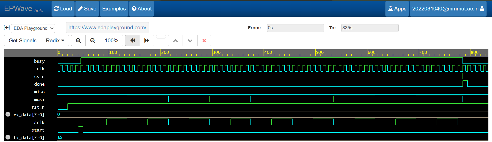

# SPI Master Controller (SystemVerilog)

A parameterized SPI Master (Mode 0) designed for high-speed serial communication between an FPGA/SoC and external peripherals.

## Key Features
* **Parameterized Data Width:** Easily switch between 8, 16, or 32-bit transfers.
* **FSM-Based Design:** Robust state machine logic (IDLE, LOAD, TRANSFER, DONE).
* **Clock Divider:** Configurable SCLK frequency relative to system clock.

## Verification Results
The design was verified using Icarus Verilog. The waveform below shows a successful 8-bit transfer (0xA5).

